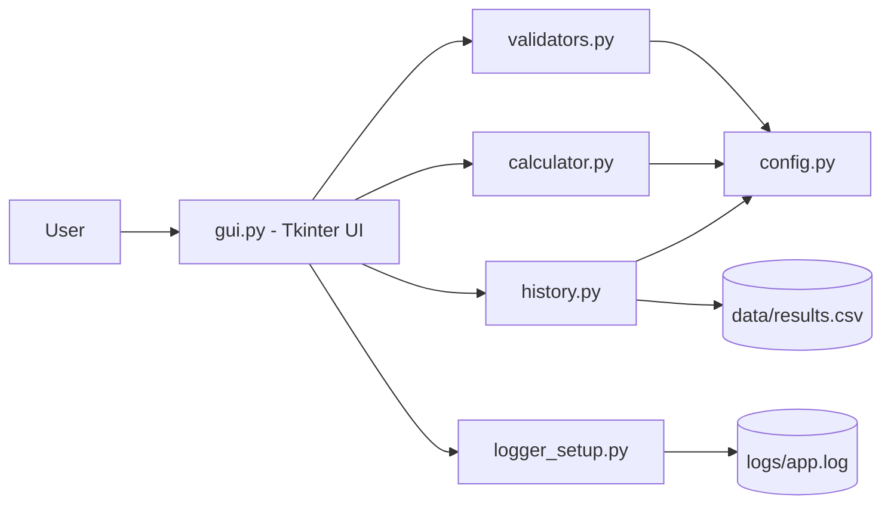
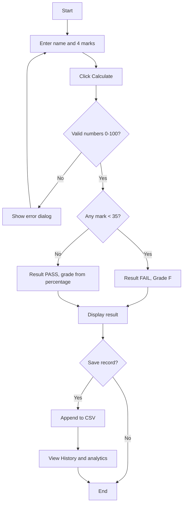
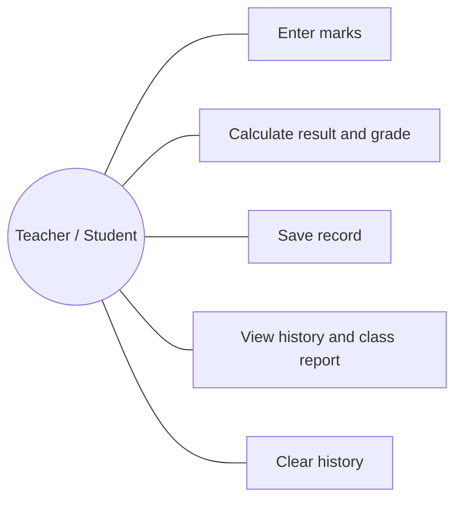
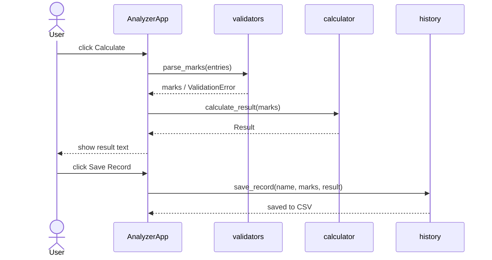
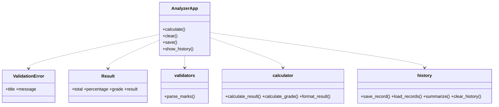
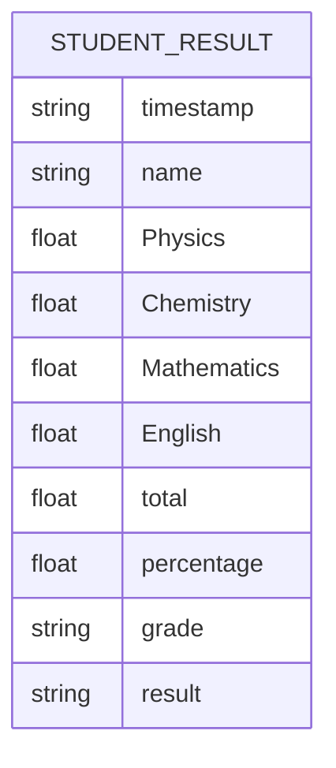

# Design Documents
(Diagrams are in Mermaid - GitHub renders them automatically.)

## System Architecture

## Workflow

## Use Case Diagram

## Sequence Diagram (Calculate & Save)

## Class / Component Diagram

## Storage Design (CSV schema) & ER

## Design decisions & rationale
- **GUI separated from logic:** `calculator` and `validators` have no Tkinter code, so they can be unit tested.
- **Config file:** pass mark, grade bands and colours live in one place.
- **CSV storage:** simple, human-readable, no database needed for this scale.
- **Custom exception:** the GUI shows the same dialog titles/messages as the original app.
